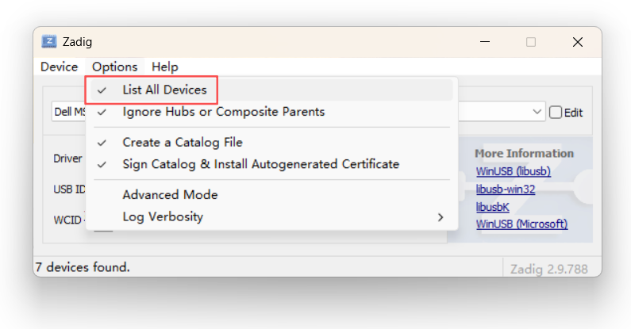
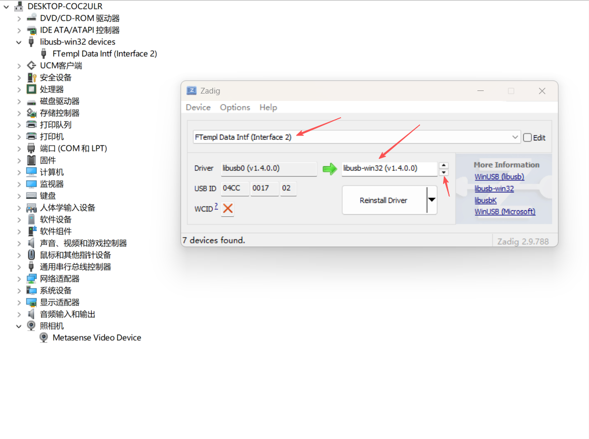
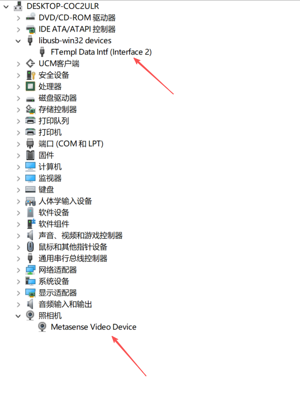

# Windows 平台驱动安装指南

VXL SDK 在 Windows 平台使用 libusb 进行 USB 通信，需要为设备安装 libusb-win32 驱动。

## 前提条件

- Windows 10/11 (x64)
- 管理员权限
- Zadig 驱动安装工具 (SDK 包含在 `3rds/win/` 目录)

## 驱动安装步骤

### 步骤 1: 运行 Zadig

1. 将深度相机通过 USB 连接到电脑
2. 进入 SDK 目录: `3rds/win/`
3. 以 **管理员身份** 运行 `zadig-2.9.exe`
4. 在菜单中选择 **Options** -> **List All Devices**

在设备下拉列表中可以看到两个接口：
- **Metasense Video Device (Interface 0)** - UVC 视频接口，无需安装驱动
- **Metasense Video Device (Interface 2)** - USB 控制接口，需要安装 libusb-win32 驱动



### 步骤 2: 安装 libusb-win32 驱动

1. 在设备下拉列表中选择 **Metasense Video Device (Interface 2)**
2. 确认 USB ID 为 `04CC` `0017` (这是设备的 VID/PID)
3. 在右侧驱动选择框中选择 **libusb-win32**
4. 点击 **Install Driver** 或 **Replace Driver** 按钮
5. 等待安装完成



> **注意**: 只需要为 Interface 2 安装驱动，Interface 0 保持原有的 UVC 驱动即可。

### 步骤 3: 验证安装

安装完成后，可以运行 SDK 示例程序验证：



```cmd
cd examples
device_info.exe
```

如果能正常列出设备信息，说明驱动安装成功。

## 常见问题

### Q: Zadig 中找不到设备？

**A:** 确保：
- 设备已正确连接且电源正常
- 已勾选 **Options** -> **List All Devices**
- 尝试更换 USB 端口或使用 USB 3.0 端口

### Q: 安装驱动后设备无法使用？

**A:** 尝试以下步骤：
1. 断开设备并重新连接
2. 重启电脑
3. 在设备管理器中卸载设备并重新安装驱动

### Q: 如何恢复原始驱动？

**A:** 在设备管理器中：
1. 右键点击设备 -> **更新驱动程序**
2. 选择 **浏览我的电脑以查找驱动程序**
3. 选择 **让我从计算机上的可用驱动程序列表中选取**
4. 选择原始驱动

### Q: 为什么只需要安装 Interface 2 的驱动？

**A:** VXL435 设备有两个 USB 接口：
- **Interface 0**: UVC 视频接口，使用 Windows 原生 UVC 驱动，SDK 通过 DirectShow 访问
- **Interface 2**: USB 控制接口，需要 libusb-win32 驱动，SDK 通过 libusb 发送控制命令

## 注意事项

- 仅 Interface 2 需要安装 libusb-win32 驱动
- Interface 0 (视频接口) 保持原有 UVC 驱动，可被 Windows 相机应用识别
- 安装后设备可同时被 VXL SDK 和 Windows 相机应用访问

## 参考链接

- [Zadig 官方网站](https://zadig.akeo.ie/)
- [libusb Windows 后端说明](https://github.com/libusb/libusb/wiki/Windows)
